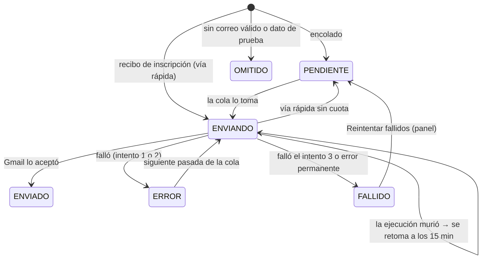

# Flujo de correos — EL BÚNKER (iteración 3)

> Vigente desde el 29-sep-2026 (sistema 3.0.0). Fuente: `apps-script/32_comunicacion.gs` (cola, plantillas, envío),
> `21_api_publico.gs`, `22_api_admin.gs`, `25_api_bolsa.gs` (quién encola), `40_setup.gs` (disparadores). Si algo difiere,
> manda el código.

## 1. Principio

- **Todo correo pasa por una sola cola**: la hoja `_EMAIL_LOG`. Cada fila es un correo concreto para una persona.
- Encolar es **idempotente por clave** (`idempotency_key`): repetir una acción no envía dos veces el mismo correo.
- Enviar respeta la **cuota diaria de Gmail** y reintenta los errores.
- Los correos salen de la cuenta de Gmail dueña del proyecto de Apps Script, con el nombre remitente de CONFIG
  `whatsapp_oficial_nombre` ("EL BÚNKER — Arte es la Solución").
- **WhatsApp no se automatiza nunca** (ver §9).

## 2. Estados de un correo (`status`)

| Estado | Significa | Qué pasa después |
|---|---|---|
| `PENDIENTE` | En cola | Lo toma la siguiente pasada de la cola, por prioridad |
| `ENVIANDO` | Tomado por una ejecución | Si esa ejecución muere, la cola lo retoma cuando `last_attempt_at` tiene más de **15 minutos** |
| `ENVIADO` | Gmail lo aceptó | Fin. Guarda el asunto enviado |
| `ERROR` | Falló un intento; `retry_count` < 3 | Se reintenta en la siguiente pasada |
| `FALLIDO` | Falló el **tercer** intento (`EMAIL_MAX_RETRIES = 3`), o error permanente: plantilla desconocida, inscripción no encontrada, contenido no permitido | Queda en `_LOG` como `CORREO_FALLIDO`. Solo vuelve a la cola con "Reintentar fallidos" |
| `OMITIDO` | La persona no tiene correo válido, o es una dirección `.test` (dato de prueba) | No se envía. Si después se corrige la dirección, el siguiente envío de esa plantilla lo vuelve a encolar (misma clave). "Reintentar fallidos" no lo toca |

## 3. Plantillas

Versión de plantillas: **`T3-2026-09-29`** (`EMAIL_TEMPLATE_VERSION`), guardada en cada fila del registro.

### 3.1 Automáticas (las encola una acción del sistema)

| Plantilla | Cuándo se encola | Disparador (código) | Destinatario | Clave de idempotencia |
|---|---|---|---|---|
| `RECEPCION` | Al enviar el Formulario 1, **solo si queda RECIBIDO** (una inscripción INCOMPLETO no recibe recibo) | `registerProject` | Correo del inscrito | `RECEPCION:<submission_id>` |
| `APTITUD` | Al decidir APTO, NO_APTO, DUPLICADO o INCOMPLETO: "Aplicar verificación", decisión manual "Decidir…", coincidencia de agrupación, "Reenviar resultados pendientes de aviso". EN_REVISION no genera correo | `queueAptitudeEmailLocked` | Inscrito | `APTITUD:<submission_id>:<estado>` |
| `ASIGNACION` | Al emitir códigos (a cada proyecto con código que aún no lo recibió) y cuando un suplente **acepta** un cupo | `accionAsignarCodigos`, `acceptOfferLocked` | Titular | `ASIGNACION:<submission_id>:<CÓDIGO>` |
| `SIN_CUPO` | Al emitir códigos, a cada APTO sin código que quedó SUPLENTE o FUERA_DE_BOLSA | `accionAsignarCodigos` | Inscrito | `SIN_CUPO:<submission_id>:<SUPLENTE o FUERA_DE_BOLSA>` |
| `OFERTA_SUPLENTE` | Cada vez que se ofrece un cupo a un suplente | `offerSlotLocked` | Suplente | `OFERTA_SUPLENTE:<oferta_id>` |
| `RETIRO_CONFIRMADO` | Cada vez que se libera un cupo (participante, logística, confirmación final NO, aptitud con liberar cupo) | `releaseSlotLocked` | Quien liberó | `RETIRO_CONFIRMADO:<submission_id>:<código liberado>` |
| `CAMBIO_SOLICITADO` | Al registrar el Formulario 2 | `accionSolicitarCambio` | Titular | `CAMBIO_SOLICITADO:<solicitud_id>` |
| `CAMBIO_APROBADO` / `CAMBIO_RECHAZADO` | Al resolver la solicitud | `accionResolverCambio` | Titular | `CAMBIO_RESUELTO:<solicitud_id>` (una sola por solicitud) |

`OFERTA_SUPLENTE` y `RETIRO_CONFIRMADO` no aparecen en el selector del panel: solo los genera el sistema.
El envío manual desde el panel usa **la misma clave** que el envío automático (`emailKey`), así que reenviar, por ejemplo,
«Resultado de aptitud» a quien ya lo recibió no le manda una segunda copia. Los envíos masivos (aplicar verificación,
emitir códigos, «Enviar por correo») leen el registro una sola vez y escriben todas las filas de una vez: con uno por uno,
127 resultados de aptitud tardaron 3,6 min en vivo (29-sep), cerca del límite de 6 min de Apps Script.
`RETIRO_CONFIRMADO` dice que el cupo se ofrece a la bolsa **si todavía hay tiempo para reemplazos**, y si no, que queda vacante.

### 3.2 Manuales (Comunicación → "Enviar por correo")

Se eligen en el panel; el sistema encola a toda la audiencia de la plantilla (opcional: filtrar por bloque). Nunca incluye
a proyectos retirados.

| Plantilla | Audiencia (código) | Uso previsto |
|---|---|---|
| `CONFIRMACION_FINAL` | Con código y sin confirmación final | Pedir SÍ CONFIRMO / NO PODRÉ ASISTIR. El correo dice la ventana (desde `confirmacion_final_desde` hasta `confirmacion_final_hasta`), así que puede enviarse la víspera (21-oct) para no competir por la cuota del 22-oct |
| `RECORDATORIO_24H` | Con código | Día anterior al evento |
| `RECORDATORIO_DIA` | Con código | Día del evento |
| `CONTINGENCIA` | Asistencia CONTINGENCIA o NO SHOW | Día del evento |
| `FIRMAS_PENDIENTES` | Con código y menos intérpretes autorizados que declarados | Antes del evento (repetible 1 vez por día) |
| `PISTA_PENDIENTE` | Con código, usa pista y pista PENDIENTE | Antes del evento (repetible 1 vez por día) |
| `RESULTADO_FINAL` | Audicionados (REALIZADA). **Solo disponible con resultados cerrados** | Tras "Cerrar resultados". Dice SELECCIONADO o NO SELECCIONADO; nunca el Top 20 |
| `GRUPO_WHATSAPP` | Autorizó WhatsApp y es APTO o tiene código. **Solo disponible si CONFIG `whatsapp_grupo_enlace` tiene un enlace https** | Invitación al grupo de WhatsApp |

Las automáticas con audiencia (`RECEPCION`, `APTITUD`, `ASIGNACION`, `SIN_CUPO`, `CAMBIO_*`) también aparecen en el
selector.

Clave de los envíos manuales: `<PLANTILLA>:<submission_id>:<código>`; para `FIRMAS_PENDIENTES` y `PISTA_PENDIENTE` se
agrega `:<AAAAMMDD>`, por eso se pueden repetir una vez por día.

La lista del selector se arma al abrir el panel: después de cerrar resultados (o de configurar el enlace del grupo) hay que
**recargar la página** para ver `RESULTADO_FINAL` (o `GRUPO_WHATSAPP`).

### 3.3 Contenido común

- Texto plano + HTML con **las mismas palabras** (el HTML se construye desde el texto).
- Primera línea: el aviso **"Revisa también las carpetas Spam y Promociones y marca nuestros correos como "No es spam"
  para no perderte los siguientes."** En HTML va en un recuadro amarillo arriba.
- Cada mensaje dice **ESTADO**, **SIGUIENTE PASO** y, cuando aplica, fecha, hora y lugar
  (viernes 23 de octubre de 2026, 3:00 p. m. a 9:00 p. m., Centro Comercial Mayorca · Etapa 1, Sabaneta, Antioquia).
- Los que lo necesitan incluyen el enlace a "Mi inscripción" y el recordatorio de guardar el número oficial de WhatsApp.
- Los enlaces "equipo y firmas" que viajan en los correos llevan la clave del proyecto (acceso autenticado del equipo).

## 4. Cómo se envía la cola

| Quién la procesa | Cuándo | Máximo por pasada |
|---|---|---|
| Disparador `procesarColaCorreos` | **Cada 15 minutos** | 40 |
| "Aplicar verificación", "Reenviar resultados pendientes de aviso", "Emitir códigos" | Al terminar la acción | 15 |
| "Enviar por correo" | Al terminar la acción | 40 |
| Formulario 1 (vía rápida del recibo) | En la misma petición | 1 |

Los correos que encolan otras acciones (retiro, oferta, cambio de horario, aceptación de oferta) **esperan a la siguiente
pasada del disparador**: pueden tardar hasta ~15 minutos en salir.

Orden dentro de una pasada (`EMAIL_PRIORITY`, menor sale primero; a igual prioridad, el más antiguo):

| Prioridad | Plantillas |
|---|---|
| 1 | RECEPCION, OFERTA_SUPLENTE |
| 2 | ASIGNACION, CAMBIO_APROBADO, CAMBIO_RECHAZADO, CONTINGENCIA |
| 3 | CAMBIO_SOLICITADO, RETIRO_CONFIRMADO, CONFIRMACION_FINAL, RECORDATORIO_DIA |
| 4 | APTITUD, RECORDATORIO_24H |
| 5 | SIN_CUPO, RESULTADO_FINAL |
| 6 | FIRMAS_PENDIENTES, PISTA_PENDIENTE |
| 7 | GRUPO_WHATSAPP |

Cada pasada: toma las filas bajo bloqueo y las marca `ENVIANDO`, envía fuera del bloqueo y anota el resultado bajo
bloqueo otra vez. Dos pasadas simultáneas nunca envían la misma fila.

## 5. Cuota de Gmail

- Una cuenta de Gmail de consumo envía **alrededor de 100 correos al día** (lo dicen CONFIG y el panel). El código no fija
  ese número: lee la cuota real restante con `MailApp.getRemainingDailyQuota()`.
- Reserva: `EMAIL_QUOTA_RESERVE = 0` (se puede usar toda la cuota).
- Lo que no cabe hoy se queda `PENDIENTE` y sale en las pasadas siguientes; la respuesta de "Enviar por correo" indica
  cuántos quedaron por cuota.
- Implicación práctica: emitir 100 códigos genera ~100 correos `ASIGNACION` más los `SIN_CUPO`; con la cuota de un día
  saldrán en uno o más días. Las ofertas a suplentes (prioridad 1) pasan delante, pero su plazo de 24 h corre desde que se
  crea la oferta, no desde que llega el correo.

## 6. Vía rápida del recibo de inscripción (`deliverClaimedEmail`)

1. Dentro del bloqueo, al guardar la inscripción, la fila `RECEPCION` se escribe **ya tomada** (`ENVIANDO`, con
   `last_attempt_at`).
2. Al salir del bloqueo, la misma petición envía el recibo con los datos que ya tiene en memoria.
3. Si **no hay cuota**, la fila vuelve a `PENDIENTE` y la envía la cola.
4. Si la petición **muere** antes de enviar, la fila queda `ENVIANDO`; la cola la retoma cuando pasan 15 minutos.
5. Resultado en ambos casos: se registra igual que cualquier envío (ENVIADO, ERROR o FALLIDO).

## 7. Guardia de enlaces de producción (`forbiddenLink`)

Antes de enviar, el asunto y el cuerpo se revisan contra: `localhost`, `127.0.0.1`, URL `/dev` (la de pruebas del
propietario), `staging`, dominios del repositorio anterior y **cualquier `{{marcador}}` sin llenar**.

- En **producción**, cualquier coincidencia bloquea el envío: `FALLIDO` con error `CONTENIDO_NO_PERMITIDO` (permanente, no
  se reintenta solo).
- En **pruebas**, solo bloquea un marcador sin llenar.
- Por diseño, un dato faltante deja el `{{marcador}}` visible en el texto, así un mensaje a medio llenar nunca sale sin que
  se note.
- Causa típica: CONFIG `web_app_url` vacío o mal puesto. "Estado del sistema" avisa si falta la URL `/exec`.

## 8. Qué hace el equipo desde el panel (Comunicación)

| Botón | Qué hace | Quién |
|---|---|---|
| Generar textos | Muestra el texto exacto de cada destinatario y, si autorizó WhatsApp y tiene celular válido, un botón "Abrir chat". No envía nada | Logística, admin |
| Enviar por correo | Encola la plantilla para toda su audiencia (o un bloque) y procesa hasta 40. Informa encolados, ya enviados antes, sin correo válido, enviados ahora, cuota restante | Logística, admin |
| Registro de correos | Últimos 300 correos, filtro por estado (Todos, En cola, Enviados, Fallidos, Omitidos), con plantilla, versión, destinatario enmascarado, código, reintentos, error y cuota restante | Logística, admin |
| Reintentar fallidos | Pasa **todos** los `FALLIDO` a `PENDIENTE`, pone `retry_count = 0` y toma el correo actual de REGISTRO. Salen en la próxima pasada (máx. 15 min) | Logística, admin |
| Reenviar resultados pendientes de aviso (pestaña Aptitud y códigos) | Encola `APTITUD` a quien aún no conoce su estado actual | Logística, admin |

Para corregir un correo mal escrito: se corrige la columna `email` de la persona en REGISTRO y se pulsa "Reintentar
fallidos". El dashboard muestra "Correos enviados / en cola / con error".

## 9. WhatsApp

- WhatsApp es un **canal**, no una base de datos: el estado oficial de cada persona está en el sistema ("Mi inscripción").
- **Nunca se automatiza.** El panel prepara el texto y un enlace de chat (`wa.me`) solo para quien autorizó WhatsApp
  (`consent_whatsapp`) y tiene un celular colombiano válido; una persona del equipo abre el chat y pulsa enviar desde el
  número oficial (CONFIG `whatsapp_oficial`: 323 983 6182). Enviar automáticamente exigiría la API paga de WhatsApp
  Business.
- "Contactos para la lista de difusión" descarga un archivo `.vcf` (con código, o aptos y con código) de quienes
  autorizaron WhatsApp, para importarlo en el teléfono oficial. Las listas de difusión solo llegan a quien también guardó
  el número oficial; por eso todos los correos piden guardarlo.
- El grupo de WhatsApp de aptos existe solo si la organización pone su enlace en CONFIG `whatsapp_grupo_enlace`.
