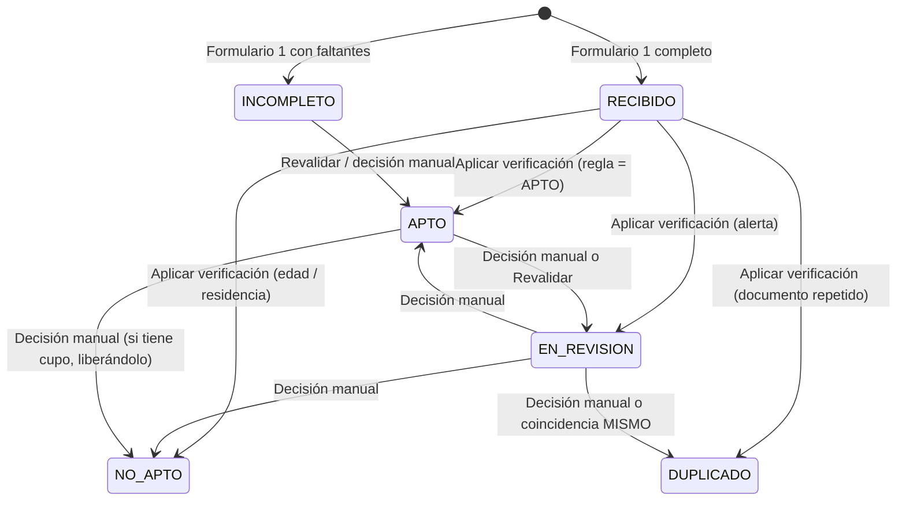
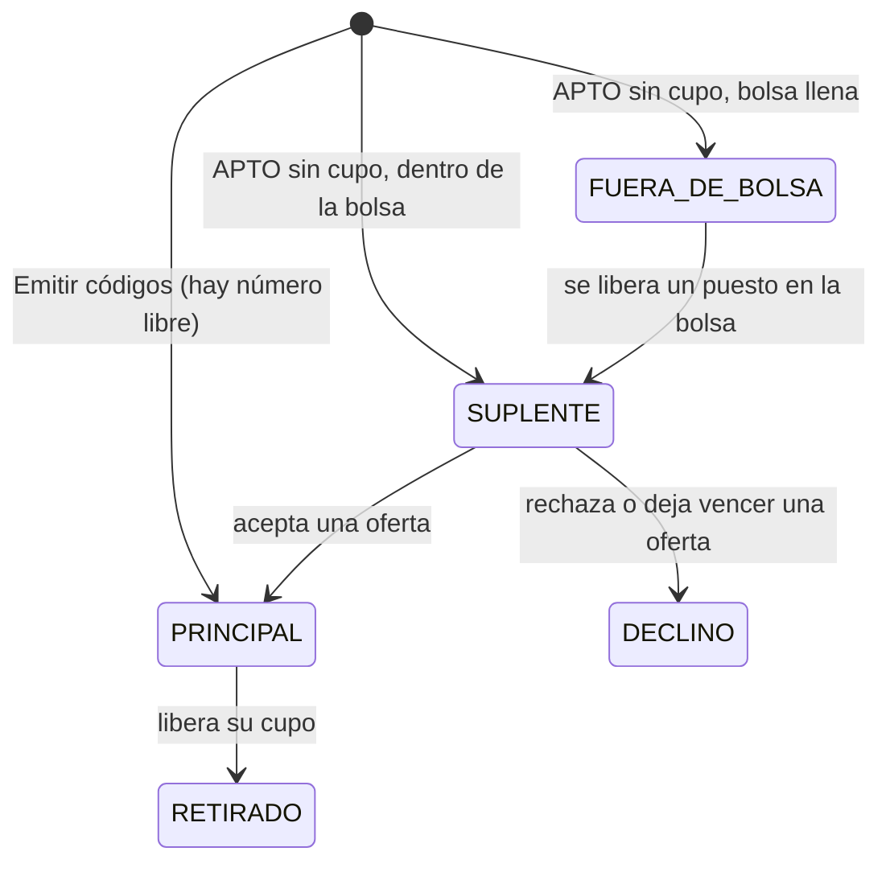
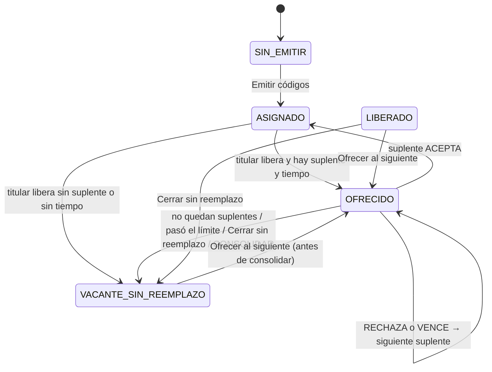
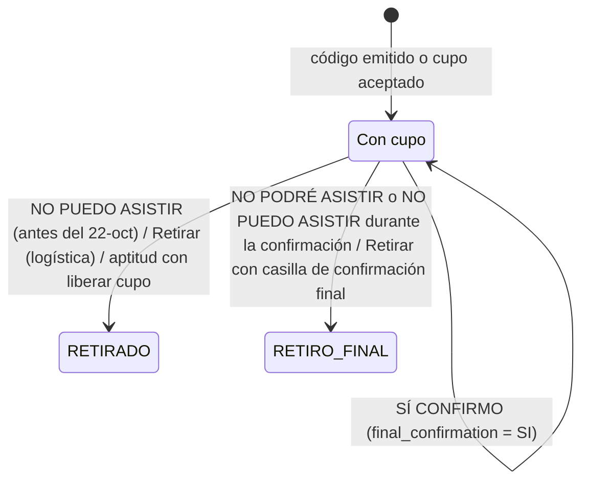
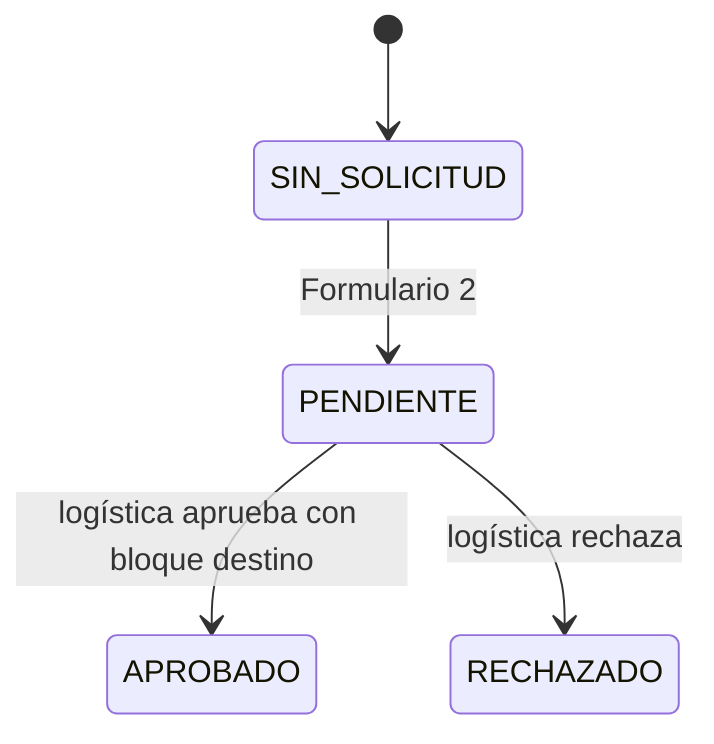
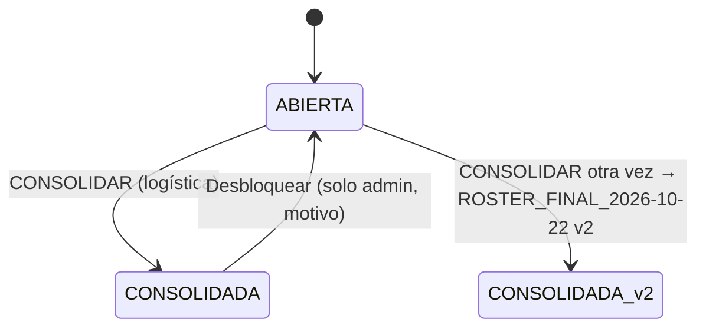
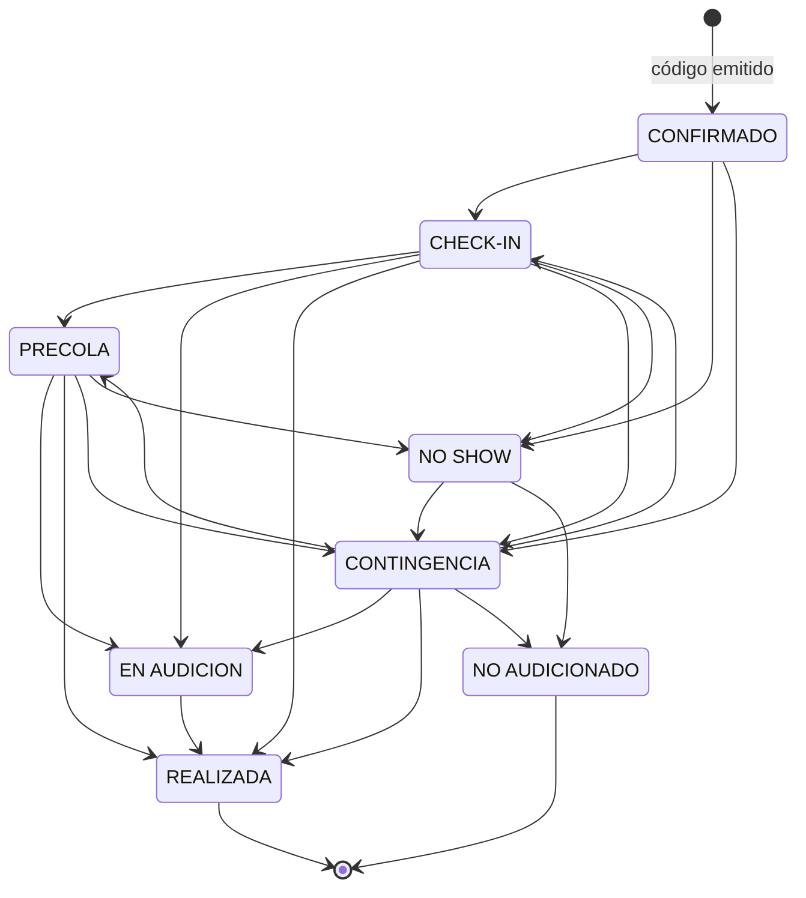
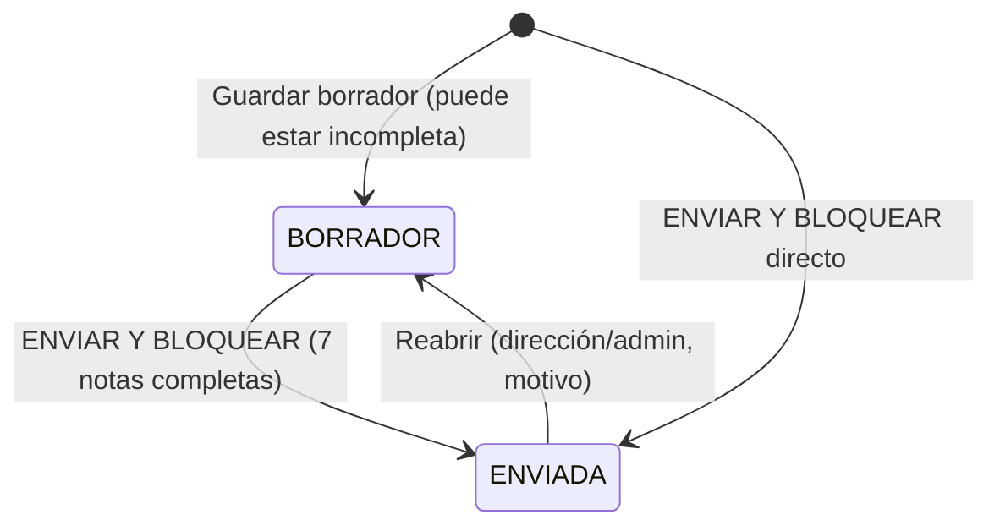
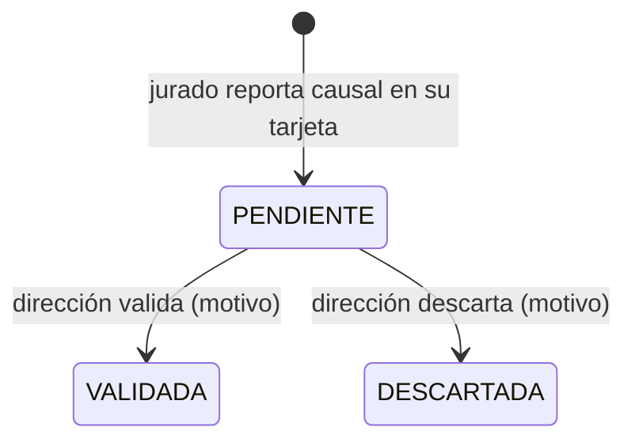
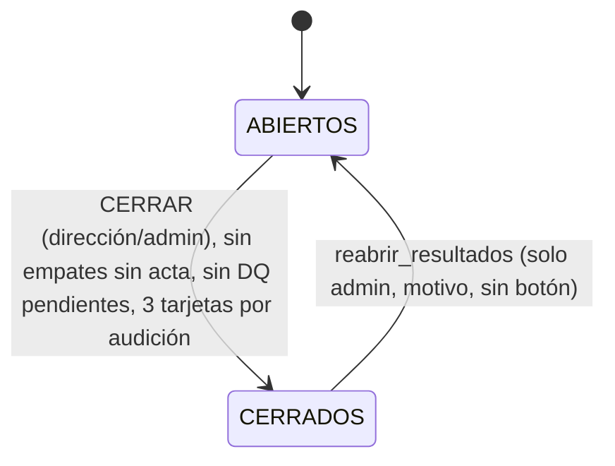

# Flujo de estados — EL BÚNKER (iteración 3)

> Vigente desde el 29-sep-2026 (sistema 3.0.0). Fuente: `apps-script/01_core_validacion.gs`, `02_core_codigos.gs`,
> `03_core_agenda.gs`, `05_core_estados.gs`, `21_api_publico.gs`, `22_api_admin.gs`, `23_api_checkin.gs`,
> `24_api_jurado.gs`, `25_api_bolsa.gs`, `30_vistas.gs`. Si algo difiere, manda el código.

Cada máquina de estados tiene: diagrama, tabla de transiciones (quién o qué la dispara) y reglas. "Logística" = rol
`logistica` (cuenta de coordinación). Todo lo que puede logística lo puede también `admin`.

## 0. Ventanas del calendario (CONFIG)

`operationWindows()` decide qué está abierto en cada momento:

| Ventana | Abierta cuando | Valores por defecto |
|---|---|---|
| Liberar cupo ("NO PUEDO ASISTIR") | desde `reemplazos_desde` y mientras la lista **no** esté consolidada | desde vie 16-oct-2026 00:00 |
| Ofrecer cupos a suplentes | antes de `reemplazo_limite` y con la lista sin consolidar | hasta jue 22-oct-2026 12:00 |
| Confirmación final | entre `confirmacion_final_desde` y `confirmacion_final_hasta`, lista sin consolidar | jue 22-oct 00:00 → 20:00 |
| Formulario 2 (cambio de horario) | `cambios_abiertos = SI`, antes de `cierre_cambios`, lista sin consolidar | hasta jue 22-oct 18:00 |
| Lista oficial consolidada | `lista_oficial_bloqueada = SI` | la pone el botón CONSOLIDAR |

Todas las horas son de Colombia (UTC−05:00).

---

## 1. Aptitud (`eligibility_status`)

**Al enviar el Formulario 1** (`registerProject`) se calcula el veredicto automático y se guarda en `eligibility_auto`:

| Veredicto automático | Causa en el código |
|---|---|
| `NO_APTO` | Edad fuera de 18–30 años cumplidos el 23-oct-2026, o declara no residir en Sabaneta |
| `INCOMPLETO` | Falta un dato o consentimiento obligatorio, formato inválido (documento, correo, celular, nombre), forma del proyecto inválida, o falta la firma (con `firma_inscripcion = SI`) |
| `DUPLICADO` | Mismo número de documento que otra inscripción no incompleta (gana la primera) |
| `EN_REVISION` | Enlace de video con formato dudoso, o (si la regla daba APTO) correo o celular repetido, o agrupación con nombre equivalente a otra |
| `APTO` | Todo lo demás |

El estado oficial queda **`RECIBIDO`** (o `INCOMPLETO` si el veredicto fue incompleto). **RECIBIDO nunca se presenta como
APTO.** Solo la inscripción `RECIBIDO` recibe el correo de recepción.

| Desde | Hacia | Disparador | Quién |
|---|---|---|---|
| — | `RECIBIDO` / `INCOMPLETO` | Enviar Formulario 1 | Participante |
| `RECIBIDO` | el valor de `eligibility_auto` (o `EN_REVISION` si está vacío) | **"Aplicar verificación y enviar resultados"** (`accionAplicarVerificacion`). Solo toca filas `RECIBIDO` | Logística |
| cualquiera | `APTO`, `EN_REVISION`, `INCOMPLETO`, `NO_APTO`, `DUPLICADO` | Selector "Decidir…" en Inscritos, con motivo (`accionMarcarElegibilidad`). Queda como `eligibility_override` | Logística |
| `EN_REVISION` (posible agrupación repetida) | `DUPLICADO` ("Es el mismo proyecto") o re-evaluada ("Son proyectos distintos") | Pestaña Agrupaciones (`accionResolverCoincidenciaGrupo`) | Logística |
| decidido sin decisión manual | lo que diga la regla | "Revalidar inscripciones" (`accionRevalidarTodo`) | Logística |

Reglas:

- Correo `APTITUD` al decidir `APTO`, `NO_APTO`, `DUPLICADO` o `INCOMPLETO` (una vez por estado). `EN_REVISION` no genera
  correo.
- "Revalidar" respeta toda decisión manual, deja en `RECIBIDO` lo que aún no se verificó y **nunca** baja a un titular de
  cupo por debajo de `EN_REVISION`.
- Un titular de cupo solo pasa a `NO_APTO`, `DUPLICADO` o `INCOMPLETO` **liberando el cupo** (el panel lo pregunta); el
  cupo se ofrece al siguiente suplente.
- Nada se borra: una inscripción `INCOMPLETO` se corrige enviando el formulario de nuevo, y la nueva no queda duplicada.

---

## 2. Bolsa (`pool_status` y `priority_rank`)

- **`priority_rank`**: posición por fecha y hora de inscripción (`created_at`, desempate por `submission_id`) entre todos
  los APTO no duplicados, **incluidos los retirados**. Un retiro no mueve a nadie. Nunca se usa puntaje antes de la
  audición.
- `PRINCIPAL` = tiene código B-XXX. `SUPLENTE` = los siguientes **100** APTO sin código (`bolsa_aptos` − `cupo_total`
  = 200 − 100), sin retirados ni `DECLINO`, en orden de prioridad. `FUERA_DE_BOLSA` = el resto.
- La bolsa se **rellena**: cuando un suplente pasa a PRINCIPAL o a DECLINO, el siguiente FUERA_DE_BOLSA pasa a SUPLENTE.
- `DECLINO` es definitivo: esa persona no vuelve a recibir ofertas.
- Los códigos se emiten en orden de inscripción entre los APTO **en el momento de pulsar "Emitir códigos"**. Una
  inscripción anterior que se decida APTO después recibe su lugar en `priority_rank`, pero no quita un código ya emitido:
  toma un número libre si queda alguno o entra a la bolsa. Por eso el panel pide resolver las `EN_REVISION` antes de emitir.
- Se recalcula (`refreshPoolLocked`) tras aptitud, emisión de códigos, retiros, ofertas, cambios y consolidación, y con
  "Recalcular bolsa y vencer ofertas".

---

## 3. Cupo y reemplazo (`_OFERTAS`, estado del cupo)

Estados del cupo (`slotStatuses`): `ASIGNADO` (tiene titular), `OFRECIDO` (oferta pendiente), `LIBERADO` (fue emitido, sin
titular y sin oferta abierta ni cierre), `VACANTE_SIN_REEMPLAZO` (cerrado sin reemplazo), `SIN_EMITIR`.

Estados de la oferta: `PENDIENTE` → `ACEPTADA` | `RECHAZADA` | `VENCIDA` | `CANCELADA`. Una fila `VACANTE_SIN_REEMPLAZO` en
`_OFERTAS` registra el cierre del cupo.

**Liberar** (`releaseSlotLocked`): el titular pierde el `code` (queda en `previous_code`), `withdrawal_status` =
`RETIRADO` o `RETIRO_FINAL`, `pool_status = RETIRADO`, historial `LIBERADO`/`RETIRO_FINAL`, correo `RETIRO_CONFIRMADO`.
Luego, si la ventana de reemplazo sigue abierta, se ofrece; si no, queda vacante. **Solo se mueve ese cupo.**

**Ofrecer** (`offerSlotLocked`):

1. Vencimiento = creación + `suplente_horas_respuesta` (24 h), **pero nunca después de `reemplazo_limite`**
   (22-oct 12:00).
2. Si quedaría menos de **1 hora** para responder → vacante ("No queda tiempo suficiente…").
3. Suplente = el `SUPLENTE` de menor `priority_rank` sin otra oferta pendiente. Si no hay → vacante.
4. Crea la oferta `PENDIENTE`, historial `OFRECIDO`, correo `OFERTA_SUPLENTE`.

| Evento | Resultado | Quién |
|---|---|---|
| Suplente pulsa **ACEPTAR EL CUPO** en "Mi inscripción" | Oferta `ACEPTADA`; su fila recibe `code`, bloque, hora de llegada y de audición del cupo; `attendance_status = CONFIRMADO`; `change_status = SIN_SOLICITUD`; `final_confirmation` vacía; `issued_by = reemplazo:OF-…`; correo `ASIGNACION` | Suplente |
| Suplente pulsa **No puedo** | Oferta `RECHAZADA`, suplente `DECLINO`, se ofrece al siguiente (o vacante tras el límite) | Suplente |
| Pasa el vencimiento | Oferta `VENCIDA`, suplente `DECLINO`, siguiente. Lo procesa el disparador **cada hora** (`vencerOfertas`), o antes si el suplente intenta responder, si logística pulsa "Recalcular bolsa y vencer ofertas" u "Ofrecer al siguiente", o al consolidar | Sistema |
| "Cerrar sin reemplazo" (motivo) | Oferta pendiente `CANCELADA` (el suplente no queda DECLINO), cupo vacante | Logística |
| "Ofrecer al siguiente" en un cupo LIBERADO o VACANTE | Nueva oferta con las reglas 1–4 (tras el límite vuelve a quedar vacante) | Logística |
| CONSOLIDAR | Toda oferta pendiente pasa a `CANCELADA` y su cupo queda vacante | Logística |

Ejemplos de vencimiento (calculados con `offerExpiry`): oferta creada el 17-oct 10:00 → vence 18-oct 10:00. Oferta creada el
21-oct 15:00 → vence 22-oct 12:00 (tope). Cupo liberado el 22-oct 11:15 → quedan 45 min → vacante directa.

---

## 4. Retiro y confirmación final

| Acción | Condiciones del código | Quién |
|---|---|---|
| "NO PUEDO ASISTIR — SOLICITAR REEMPLAZO" (`accionRetirarme`) | Documento + código (o comprobante); tiene cupo; desde `reemplazos_desde`; lista sin consolidar; escribir **LIBERAR MI CUPO**. Si la confirmación final está abierta, cuenta como `RETIRO_FINAL`. No se puede deshacer | Participante |
| "SÍ CONFIRMO" (`accionConfirmacionFinal`) | Tiene cupo; ventana de confirmación abierta; lista sin consolidar. Guarda `final_confirmation = SI`; nada cambia de horario | Participante |
| "NO PODRÉ ASISTIR" | Igual, más escribir **LIBERAR MI CUPO**. Libera el cupo como `RETIRO_FINAL` (`final_confirmation = NO`) | Participante |
| "Retirar y ofrecer el cupo" (`accionRetirarParticipante`) | Código + motivo (mín. 5 caracteres); lista sin consolidar. **No tiene restricción de fecha**: sirve también antes del 16-oct. Casilla "retiro de la confirmación final" → `RETIRO_FINAL` | Logística |

Quien confirma SÍ todavía puede responder NO dentro de la ventana (libera el cupo). El suplente que acepta un cupo empieza
sin confirmación final: debe confirmar él mismo si la ventana está abierta.

---

## 5. Cambio de horario (`change_status`, `_CAMBIOS`)

| Transición | Reglas del código | Quién |
|---|---|---|
| → `PENDIENTE` | Tiene código; declara que no puede asistir en su horario; nombre igual al registrado; **una sola solicitud por código**; antes de `cierre_cambios` (22-oct 18:00); `cambios_abiertos = SI`; lista sin consolidar. Correo `CAMBIO_SOLICITADO` | Participante |
| → `APROBADO` | Bloque destino con cupo libre al momento de aprobar (bloques 1–10 de 10 cupos; "Margen operativo" 8:00–8:30 p. m. con `cupo_margen_cambios` = 10). **El código no cambia**, solo `final_block`, `final_time`, `arrival_time`. Correo `CAMBIO_APROBADO` | Logística |
| → `RECHAZADO` | Horario original sigue vigente. Correo `CAMBIO_RECHAZADO` | Logística |

Mientras está `PENDIENTE`, el horario vigente es el original. Tras consolidar la lista no se puede resolver.

---

## 6. Lista oficial del evento

**CONSOLIDAR LISTA OFICIAL DEL EVENTO** (`accionConsolidarLista`, escribir **CONSOLIDAR**):

1. Vence las ofertas caducadas; **cancela las pendientes** y deja sus cupos vacantes.
2. Reconcilia cupos, titulares, confirmaciones, reemplazos, vacantes, retiros, suplentes y cambios pendientes.
3. Si hay un código con dos titulares, se detiene.
4. Crea la hoja `ROSTER_FINAL_2026-10-22` (protegida) y una copia JSON en Drive.
5. Pone `lista_oficial_bloqueada = SI` (+ versión, fecha y autor).

Con la lista consolidada quedan bloqueados: liberar cupo, confirmación final, aceptar ofertas, retirar (logística),
ofrecer cupos, solicitar y resolver cambios, emitir códigos. **No** bloquea el check-in ni la evaluación.
"Desbloquear" es solo del admin (motivo de 10+ caracteres); al volver a consolidar se crea una versión nueva.

---

## 7. Día del evento: asistencia (`attendance_status`)

(Desde cualquier estado se puede pasar a `INCIDENTE`, y de `INCIDENTE` a cualquiera salvo `CONFIRMADO`; la mesa no tiene botón para ello.)

| Botón en la mesa (`ui_checkin.html`) | Estado | Además guarda |
|---|---|---|
| Confirmar CHECK-IN | `CHECK-IN` | `check_in_time` (la primera vez) |
| Pasar a PRECOLA | `PRECOLA` | `precola_at` |
| Sube a escena (EN AUDICIÓN) | `EN AUDICION` | `stage_at` |
| Audición REALIZADA (salida) | `REALIZADA` | `audition_status = REALIZADA`, `done_at` → **ya se puede calificar** |
| Pasar a CONTINGENCIA | `CONTINGENCIA` | `contingencia_desde` (la primera vez) |
| Marcar NO SHOW | `NO SHOW` | `audition_status = NO SHOW` |

- La pantalla solo muestra los botones permitidos desde el estado actual (tabla `TRANSICIONES`). El servidor rechaza
  cualquier otra transición. Forzar una transición no permitida solo es posible por API y siempre crea un INCIDENTE.
- La mesa trabaja **sin conexión**: guarda la operación en el dispositivo y la sincroniza después; cada operación tiene su
  id, así que repetir la sincronización no duplica nada.
- **Puntualidad** (`evaluarPuntualidad`): llegada ≤ hora de audición = a tiempo; hasta 5 min tarde (`tolerancia_min`) =
  conserva el turno solo si no altera el flujo (decide el coordinador); más de 5 min = pierde el turno y pasa a
  CONTINGENCIA. Nunca se desplaza a quien llegó puntual.
- **Contingencia** (`planificarContingencia`, pestaña Contingencia): cola de CONTINGENCIA y NO SHOW por orden de entrada a
  contingencia; tiempo desde máx(ahora, 8:30 p. m.) hasta 9:00 p. m.; 3 min por audición + 1 min de margen → caben 7 si se
  calcula a las 8:30 p. m.; los demás quedan sugeridos NO AUDICIONADO.
- **Cerrar jornada** (`accionCerrarJornada`, logística): todo proyecto con código que no esté REALIZADA, NO AUDICIONADO
  o EN AUDICION pasa a `NO AUDICIONADO` (queda fuera de la selección). Quien está en escena termina y se marca REALIZADA.

---

## 8. Tarjeta de evaluación (por jurado)

- Solo se califica con audición `REALIZADA`. Solo cuentan las `ENVIADA`.
- Reabrir: dirección o admin, motivo de 5+ caracteres, resultados sin cerrar. Queda `reabierta_at/by/motivo` y el total
  previo en `_LOG`.
- Con `resultados_cerrados = SI` nada se guarda ni se reabre. Detalle: `RUBRICA_JURADOS.md` §7.

---

## 9. Descalificación (`dq_status`, `_DESCALIFICACIONES`)

- Un reporte abierto por proyecto y jurado. `PENDIENTE` mantiene el proyecto en el ranking con aviso e impide cerrar
  resultados. `VALIDADA` lo saca del ranking (`DESCALIFICADO`). `DESCARTADA` limpia el estado si no queda otro reporte
  pendiente o validado.

---

## 10. Resultados

### 10.1 Estado de evaluación del proyecto (`evaluation_status`)

| Estado | Cuándo |
|---|---|
| `SIN_CALIFICAR` | Ninguna tarjeta |
| `PARCIAL` | Alguna tarjeta, menos de 3 enviadas |
| `COMPLETA` | 3 tarjetas enviadas |
| `BLOQUEADA` | 3 enviadas y resultados cerrados |
| `DQ_PENDIENTE` | Hay un reporte de descalificación pendiente |
| `DESCALIFICADO` | Descalificación validada |

### 10.2 Estado en el ranking (`ranking_status`)

`TOP10_SELECCIONADO` (1–10) · `TOP20` (11–20, privado) · `RANKED` (21+ antes del cierre) · `NO_SELECCIONADO` (21+ tras el
cierre) · `TIE_REVIEW_REQUIRED` (empate que cruza el 10 o el 20) · `SIN_RANKING` (no audicionó, descalificado o con menos
de 3 tarjetas enviadas). Cálculo y actas: `RUBRICA_JURADOS.md`.

### 10.3 Cierre de resultados (`resultados_cerrados`)

Tras cerrar: tarjetas bloqueadas, Top 10 definitivo, y logística/admin envían `RESULTADO_FINAL` desde Comunicación.

---

## 11. Estado de participación derivado (`participation_status`)

Lo calcula `participationStatus()`; se evalúa en este orden (gana la primera regla que se cumple):

| # | Condición | Estado |
|---|---|---|
| 1 | Asistencia REALIZADA | `AUDICIONADO` |
| 2 | Asistencia NO AUDICIONADO | `NO_AUDICIONADO` |
| 3 | Asistencia NO SHOW | `NO_SHOW` |
| 4 | Asistencia CONTINGENCIA | `CONTINGENCIA` |
| 5 | Retiro en la confirmación final | `RETIRO_FINAL` |
| 6 | Retiro | `RETIRADO` |
| 7 | Tiene una oferta de cupo pendiente | `INVITADO` |
| 8 | Sin código | `SIN_TURNO` |
| 9 | Confirmación final = NO | `NO_CONFIRMADO` |
| 10 | Cambio de horario pendiente | `CAMBIO_PENDIENTE` |
| 11 | Confirmación final = SI | `CONFIRMADO` |
| 12 | Cambio aprobado | `CAMBIO_APROBADO` |
| 13 | Con código, sin nada de lo anterior | `INVITADO` |

## 12. Otros estados

| Qué | Estados | Quién cambia |
|---|---|---|
| Persona del equipo (`member_status`) | `AUTORIZADO` (datos, consentimientos y firma completos), `INCOMPLETO`, `NO CUMPLE` (menor de 18 el día del evento) | La propia persona en el enlace "equipo y firmas" (vuelve a enviar para corregir) |
| Pista (`track_status`) | `NO APLICA`, `PISTA PENDIENTE` → `PISTA RECIBIDA` → `PISTA VALIDADA` o `PISTA CON PROBLEMA` | Participante (subida desde "Mi inscripción", solo con código); logística (subida por WhatsApp y marcado) |
| Video (`video_check_status`) | `SIN VIDEO`, `PENDIENTE`, `ACCESIBLE`, `NO ACCESIBLE`, `NO VERIFICABLE` | Sistema (al enviar y cada hora); logística fuerza la verificación |
