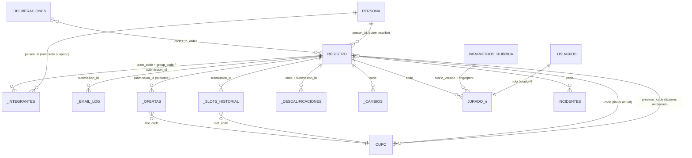
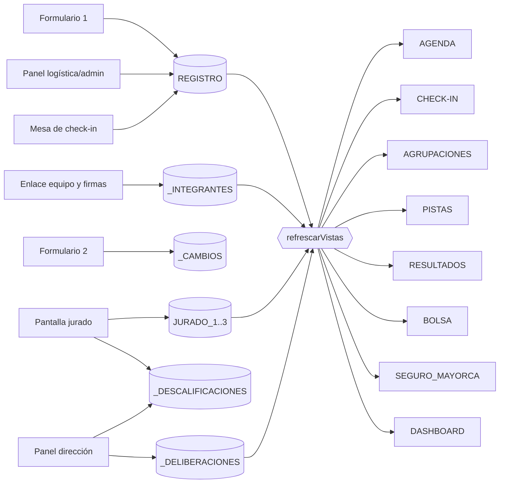

# Modelo de datos y relaciones — EL BÚNKER (iteración 3)

> Vigente desde el 29-sep-2026 (sistema 3.0.0). Fuente: `apps-script/00_config.gs` (`HOJA`, `COLUMNAS_*`,
> `sheetDefinitions`), `10_db.gs`, `30_vistas.gs`, `25_api_bolsa.gs`, `32_comunicacion.gs`. Si algo difiere, manda el código.

## 1. Idea general

- La base es **una hoja de cálculo de Google** ("base maestra") con **25 pestañas** definidas en `sheetDefinitions()`, más
  la foto de la lista oficial (`ROSTER_FINAL_2026-10-22`) cuando se consolida.
- **REGISTRO es la única fuente de verdad** de los proyectos: una fila por proyecto (solista, dúo o agrupación).
- Las columnas se leen y escriben **por nombre de encabezado**. Las columnas nuevas se agregan al final; nunca se mueven.
- Hay tres tipos de hoja:
  - **Fuente**: guardan datos originales (se respaldan y se restauran).
  - **Vista**: se **borran y se reescriben** desde las fuentes. **No se editan a mano**: lo que se escriba ahí se pierde en
    la siguiente reconstrucción.
  - **Parámetro / control**: CONFIG, PARAMETROS_RUBRICA, _USUARIOS.
- Las hojas cuyo nombre empieza por `_` son internas: no se editan a mano.

## 2. Todas las hojas

| Hoja | Tipo | Para qué sirve | Quién escribe |
|---|---|---|---|
| `REGISTRO` | Fuente | Un proyecto por fila: datos del inscrito, aptitud, bolsa, código y horario, retiro, confirmación, asistencia, evaluación | Formulario 1 (público), panel de logística/admin, mesa de check-in, jurados (solo `dq_status` vía reporte), dirección (DQ), disparadores |
| `AGRUPACIONES` | Vista | Una fila maestra por dúo/agrupación y sus integrantes debajo (agrupables) | `reconstruirAgrupaciones` |
| `AGENDA` | Vista | Los 10 bloques + margen + contingencia, con ocupación | `reconstruirAgenda` |
| `CHECK-IN` | Vista | Proyectos con código en orden de bloque, con estado del día | `reconstruirCheckIn` |
| `PISTAS` | Vista | Pistas en orden de agenda para el técnico | `reconstruirPistas` |
| `JURADO_1`, `JURADO_2`, `JURADO_3` | Fuente | Una tarjeta por proyecto por jurado | Cada jurado desde su pantalla; dirección/admin al reabrir |
| `RESULTADOS` | Vista (privada) | Ranking calculado, Top 20, empates, excluidos | `reconstruirResultados` |
| `DASHBOARD` | Vista (privada) | Indicadores (incluye el Top 20 privado) | `reconstruirDashboard` |
| `INCIDENTES` | Fuente | Incidentes del día (id `INC-…`) | Transiciones forzadas del check-in; acción `nuevo_incidente` (API) |
| `CONFIG` | Parámetro | Fechas, cupos, textos legales, interruptores SI/NO | Operador (a mano) + el sistema en claves de etapa |
| `_INTEGRANTES` | Fuente | Una fila por persona y proyecto (intérpretes y equipo de trabajo) | Formulario 1 (quien inscribe) y enlace "equipo y firmas" (cada persona) |
| `_DELIBERACIONES` | Fuente | Actas de desempate (id `ACTA-…`) | Dirección/admin |
| `_CAMBIOS` | Fuente | Solicitudes de cambio de horario (id `CB-…`) | Formulario 2 (público); logística resuelve |
| `_USUARIOS` | Control | Cuentas del equipo y su **acceso autenticado** | Instalación y "Accesos del equipo" (admin) |
| `_LOG` | Fuente (bitácora) | Cada acción: quién, rol, qué, sobre qué. Sin datos personales | Todo el sistema |
| `_IDEMPOTENCIA` | Control | Respuesta guardada de cada operación ya procesada (evita dobles envíos) | Formularios, check-in, retiro, confirmación, ofertas |
| `PARAMETROS_RUBRICA` | Parámetro (fuente) | La rúbrica oficial, una fila por categoría | Se siembra sola; protegida con advertencia |
| `BOLSA` | Vista | Proyectos APTO en orden de prioridad, con oferta abierta | `reconstruirBolsa` |
| `SEGURO_MAYORCA` | Vista (privada) | Personas de cada proyecto con código, para la póliza del C.C. Mayorca | `reconstruirSeguro` |
| `_OFERTAS` | Fuente | Ofertas de cupo a suplentes (id `OF-…`) | Sistema al liberar/ofrecer; suplente responde; logística |
| `_SLOTS_HISTORIAL` | Fuente (solo agrega) | Historial de cada traspaso de cupo | Sistema |
| `_EMAIL_LOG` | Fuente | Cola y registro de correos (id `EM-…`) | Sistema; logística re-encola fallidos |
| `_DESCALIFICACIONES` | Fuente | Reportes de descalificación (id `DQ-…`) y su decisión | Jurados reportan; dirección/admin resuelven |
| `ROSTER_FINAL_2026-10-22` | Foto (protegida) | Lista oficial consolidada. Si se vuelve a consolidar tras un desbloqueo: `… v2`, `… v3` | Botón CONSOLIDAR (logística/admin) |

### 2.1 Vistas: cuándo se reconstruyen (`refrescarVistas`)

Reconstruye AGENDA, CHECK-IN, AGRUPACIONES, PISTAS, RESULTADOS, BOLSA, SEGURO_MAYORCA y DASHBOARD. Se ejecuta:

- con el disparador de tiempo **cada 6 horas**;
- con el botón "Refrescar vistas" (Respaldo y sistema);
- dentro de: emitir códigos, resolver un cambio, cerrar jornada, exportar XLSX, respaldo manual y automático, abrir
  resultados en el panel de dirección, reabrir resultados, quitar inscripciones, instalación y migración.
- RESULTADOS además se recalcula al registrar un acta y al cerrar resultados.

### 2.2 Columnas derivadas dentro de REGISTRO

REGISTRO es fuente, pero algunas columnas las **calcula el sistema** y no deben editarse a mano:

| Columna | La escribe | Nota |
|---|---|---|
| `priority_rank`, `pool_status`, `participation_status` | `refreshPoolLocked` (tras aptitud, códigos, retiros, ofertas, cambios, consolidación) | `pool_status = DECLINO` sí es estado guardado (lo pone el cierre de una oferta rechazada o vencida) y el cálculo lo respeta |
| `evaluation_status`, `ranking_status` | `reconstruirResultados` | |
| `eligibility_auto` | Formulario 1 y "Revalidar" | Veredicto automático; el oficial es `eligibility_status` |
| `age`, `normalized_*`, `duplicate_*`, `registro_principal` | Formulario 1 y "Revalidar" | |

## 3. REGISTRO: columnas por tema

| Tema | Columnas clave |
|---|---|
| Identidad del proyecto | `submission_id` (comprobante `S-XXXXXXXX`, no cambia nunca), `created_at` (orden de prioridad), `source`, `team_code`, `group_code`, `participation_mode` (SOLISTA / DUO / AGRUPACION), `members_declared`, `artistic_name`, `group_display_name` |
| Persona que inscribe | `full_name`, `document_type` (CC, CE, PPT, PASAPORTE), `id_number`, `normalized_id_number`, `person_id`, `birth_date`, `age`, `residence`, `neighborhood_sector`, `email`, `whatsapp`, firma (`signature_file_id`, `signature_sha256`, `signature_at`) |
| Propuesta | `genre_primary`, `genre_secondary`, `presentation_format`, `presentation_other`, `audition_description`, `video_url`, `video_check_*`, `needs`, `own_equipment*`, `song_name`, `track_*` |
| Consentimientos | `consent_terms`, `consent_data`, `consent_whatsapp`, `consent_image`, `consent_version`, `consent_at`, `terms_version`, `policy_version`, `data_controller`, `capture_source`, `adult_confirmation`, `availability_statement` |
| Aptitud | `eligibility_status` (oficial), `eligibility_auto` (regla), `eligibility_override` + `override_by/at` (decisión manual), `eligibility_decided_at/by`, `aptitude_notified_at`, `duplicate_flag`, `duplicate_reason`, `registro_principal`, `group_match_*`, `validation_notes` |
| Bolsa y cupo | `priority_rank`, `pool_status`, `code` (B-001…B-100, vacío si no tiene cupo), `previous_code` (cupos que tuvo antes, separados por coma), `issued_at`, `issued_by` (`reemplazo:OF-…` si lo recibió como suplente) |
| Horario | `original_block`, `original_time`, `arrival_time`, `final_block`, `final_time`, `change_requested`, `change_status`, `changed_at/by` |
| Retiro y confirmación | `withdrawal_status` (RETIRADO / RETIRO_FINAL), `withdrawn_at/by`, `withdrawal_reason`, `final_confirmation` (SI / NO), `final_confirmation_at` |
| Día del evento | `attendance_status`, `audition_status`, `check_in_time`, `precola_at`, `stage_at`, `done_at`, `contingencia_desde`, `operador_check_in`, `notes` |
| Evaluación | `participation_status`, `evaluation_status`, `ranking_status`, `dq_status` |

## 4. Identificadores y relaciones

| Identificador | Forma | Dónde nace | Qué une |
|---|---|---|---|
| `submission_id` | `S-XXXXXXXX` | Formulario 1 | Proyecto en REGISTRO ↔ `_INTEGRANTES.project_submission_id`, `_OFERTAS.submission_id` (suplente), `_EMAIL_LOG.submission_id`, `_DESCALIFICACIONES.submission_id`, `_SLOTS_HISTORIAL.submission_id`. Es la llave permanente |
| `code` | `B-001`…`B-100` | Botón "Emitir códigos" o aceptación de una oferta | El **cupo** (bloque y hora). Une REGISTRO ↔ JURADO_n, `_CAMBIOS`, `_DESCALIFICACIONES`, `_DELIBERACIONES.codes_in_order`, INCIDENTES, `_OFERTAS.slot_code`, `_SLOTS_HISTORIAL.slot_code`, carpeta `Audio/B-XXX` |
| `previous_code` | lista de códigos | Al liberar un cupo | Qué cupo(s) tuvo el proyecto. "Mi inscripción" también lo reconoce con su código anterior |
| `team_code` | `GRP-001` (dúo/agrupación) o `EQ-001` (solista) | Formulario 1 | Enlace "equipo y firmas" del proyecto. `_INTEGRANTES.group_code` guarda el `team_code`. En dúos y agrupaciones `team_code = group_code` |
| `person_id` | `P-XXXXXXXXXX` | Derivado del número de documento normalizado (`personIdFor`) | La misma persona en dos proyectos o en dos roles es una sola persona (inscrito, intérprete o equipo) |
| `member_id` | `M-XXXXXXXX` | Fila de `_INTEGRANTES` | Una relación persona–proyecto–rol. La misma persona con el mismo rol en el mismo proyecto actualiza su fila; en otro rol crea una segunda relación con el mismo `person_id` |
| `oferta_id` | `OF-XXXXXXXX` | Al ofrecer o cerrar un cupo | Oferta ↔ suplente ↔ cupo; `issued_by = reemplazo:OF-…` en REGISTRO |
| `email_id` | `EM-XXXXXXXX` | Al encolar un correo | Fila de `_EMAIL_LOG` |
| `idempotency_key` (correo) | ver `FLUJO_CORREOS.md` | Al encolar | Evita enviar dos veces el mismo correo |
| `clave` (_IDEMPOTENCIA) | ver 4.1 | En cada operación pública o de mesa | Evita escribir dos veces la misma operación |
| `solicitud_id` | `CB-XXXXXXXX` | Formulario 2 | Solicitud de cambio ↔ código |
| `dq_id` | `DQ-XXXXXXXX` | Reporte del jurado | Reporte ↔ código y `submission_id` |
| `deliberation_id` | `ACTA-XXXXXXXX` | Acta de desempate | Acta ↔ corte (10/20) ↔ códigos empatados |
| `incidente_id` | `INC-XXXXXXXX` | Incidente | Incidente ↔ código |

Reglas que se derivan del código:

- **El código es del cupo, no de la persona.** Si un titular se retira, su fila conserva el número en `previous_code` y el
  suplente que acepta recibe el mismo `code`, bloque y hora. Los datos personales nunca pasan de una fila a otra.
- **Un número emitido no se reutiliza con "Emitir códigos"** (`issuedSlotNumbers`): un cupo liberado solo cambia de manos
  por una oferta, con historial.
- **El equipo de trabajo no ocupa cupo ni entra al ranking**: vive en `_INTEGRANTES` con `person_role = EQUIPO_TRABAJO`,
  `crew_role` (MANAGER, PRODUCTOR, TECNICO, ASISTENTE, FOTOGRAFO, OTRO) y `on_stage`. Debe ser mayor de edad el día del
  evento (`integrantes_edad_minima = 18`). Aparece en SEGURO_MAYORCA.
- Las tarjetas de jurado y las descalificaciones se identifican por `code` (se crean el día del evento, con la lista ya
  consolidada).
- La carpeta `Audio/B-XXX` es del cupo: si un suplente hereda el cupo, allí puede estar el archivo del titular anterior.
  Al subir una pista nueva, los archivos anteriores se renombran `…_REEMPLAZADA_<fecha>`; nunca se borran.

### 4.1 Claves de `_IDEMPOTENCIA`

| Operación | Clave |
|---|---|
| Formulario 1 | `inscripcion:<id de envío del navegador>` |
| Enlace de equipo | `integrante:<id de envío del navegador>` |
| Subida de pista | `pista:<id de envío del navegador>` |
| Formulario 2 | `cambio:<CÓDIGO>:<id de envío del navegador>` |
| Liberar cupo (participante) | `retiro:<submission_id>` |
| Confirmación final | `confirmacion-final:<submission_id>:<SI o NO>` |
| Responder oferta | `oferta:<oferta_id>:<ACEPTAR o RECHAZAR>` |
| Cambio de estado en la mesa | `estado:<id de operación del dispositivo>` |

La misma clave devuelve la respuesta guardada (marcada `repetido`) sin escribir otra fila.

## 5. Hojas de ciclo de vida (detalle)

| Hoja | Columnas | Estados |
|---|---|---|
| `_OFERTAS` | `oferta_id, slot_code, slot_block, slot_arrival, slot_time, submission_id, priority_rank, estado, created_at, expires_at, responded_at, actor, released_by, notas` | `PENDIENTE`, `ACEPTADA`, `RECHAZADA`, `VENCIDA`, `CANCELADA`, `VACANTE_SIN_REEMPLAZO` (fila de cierre sin suplente) |
| `_SLOTS_HISTORIAL` | `at, slot_code, evento, submission_id, actor, detalle` | Eventos: `LIBERADO`, `RETIRO_FINAL`, `OFRECIDO`, `OFERTA_RECHAZADA`, `OFERTA_VENCIDA`, `ASIGNADO`, `VACANTE_SIN_REEMPLAZO`. La emisión inicial de códigos no se anota aquí (queda en `_LOG` como `ASIGNAR_CODIGOS`) |
| `_EMAIL_LOG` | `email_id, at, template_key, template_version, trigger, idempotency_key, recipient, submission_id, person_id, code, status, provider_message_id, retry_count, last_attempt_at, error, subject, payload` | `PENDIENTE`, `ENVIANDO`, `ENVIADO`, `ERROR`, `FALLIDO`, `OMITIDO` |
| `_DESCALIFICACIONES` | `dq_id, code, submission_id, causa, nota, reportado_por, reportado_at, estado, resuelto_por, resuelto_at, motivo` | `PENDIENTE`, `VALIDADA`, `DESCARTADA` |
| `_DELIBERACIONES` | `deliberation_id, at, by, codes_in_order, cut_position, minutes, status, method, participants, result` | `VIGENTE`, `REEMPLAZADA` |
| `_CAMBIOS` | `solicitud_id, at, code, full_name, original_block, original_time, can_attend_original, reason_short, contact, acceptance, estado, nuevo_bloque, nueva_hora, resuelto_at, resuelto_by, observacion, notificacion_estado` | `PENDIENTE`, `APROBADO`, `RECHAZADO`; `notificacion_estado`: CORREO EN COLA / CORREO ENVIADO / CORREO FALLIDO |
| `_INTEGRANTES` | `member_id, group_code, project_submission_id, …, person_role, crew_role, on_stage, document_type, person_id, member_status, member_alert, firma` | `member_status`: `AUTORIZADO`, `INCOMPLETO`, `NO CUMPLE` (menor de edad). Alertas: `TAMBIEN_EN_<equipo>`, `TAMBIEN_INSCRITO_<código>`, `SUPERA_INTEGRANTES_DECLARADOS` |
| JURADO_n | `code, artistic_name, discipline, presentation_format, rubric_version, rubric_fingerprint, afinacion…arena, total, desempate, estado, observaciones, dq_flag, dq_causa, dq_nota, evaluado_at, enviado_at, evaluado_by, reabierta_at, reabierta_by, reabierta_motivo` | `BORRADOR`, `ENVIADA` |

## 6. PARAMETROS_RUBRICA

Una fila por categoría: `version, orden, id, categoria, categoria_corta, categoria_no_vocal, descripcion, factor,
puntos_max, nivel_1…nivel_5, desempate`. Es el parámetro que usan los jurados y el ranking. Protegida con advertencia.
Detalle de validación y de qué pasa si se edita: `RUBRICA_JURADOS.md` §8.

## 7. ROSTER_FINAL_2026-10-22 (lista oficial)

La crea el botón "CONSOLIDAR LISTA OFICIAL DEL EVENTO" (`accionConsolidarLista`). Una fila por cupo emitido o cerrado
(B-001…B-100), columnas:

`slot_code, estado_cupo, final_block, arrival_time, final_time, submission_id, artistic_name, full_name,
participation_mode, members_declared, final_confirmation, participation_status, reemplazo, track_status, observacion`

- `estado_cupo`: ASIGNADO, OFRECIDO, LIBERADO, VACANTE_SIN_REEMPLAZO o SIN_EMITIR. `reemplazo = SI` si el titular llegó
  como suplente. `final_confirmation`: SI / SIN RESPUESTA.
- Se escribe como texto, con protección de solo advertencia ("Foto de la lista oficial consolidada. No se edita.").
- Se guarda además una copia JSON en la carpeta de respaldos de Drive con los conteos.
- El nombre base sale de CONFIG `lista_oficial_nombre`. Si ya existe, la siguiente consolidación crea `… v2`, `… v3`.
- Es una **foto**: no se actualiza sola. La operación del día (check-in) sigue leyendo REGISTRO.

## 8. _EMAIL_LOG en una línea

Cola única de correos: cada fila es un intento de un correo concreto, idempotente por `idempotency_key`. Detalle completo:
`FLUJO_CORREOS.md`.

## 9. CONFIG: quién toca qué

- El operador edita valores (columna `valor`) sin tocar código: fechas, cupos, textos legales, interruptores SI/NO. La
  columna se fuerza a texto plano para que Sheets no convierta horas en fechas.
- El sistema escribe estas claves (no editarlas a mano): `lista_oficial_bloqueada`, `lista_oficial_version`,
  `lista_oficial_at`, `lista_oficial_by`, `resultados_cerrados`. Cambiarlas a mano salta las verificaciones y no deja
  rastro en `_LOG`.
- `restaurar_desde` / `restaurar_confirmacion`: solo para recuperación (ver `MANUAL-RECUPERACION.md`).

## 10. Respaldos

- Fuentes que se respaldan y se pueden restaurar (`SOURCE_SHEETS`): REGISTRO, _INTEGRANTES, JURADO_1..3, INCIDENTES,
  _CAMBIOS, _DELIBERACIONES, PARAMETROS_RUBRICA, _OFERTAS, _SLOTS_HISTORIAL, _DESCALIFICACIONES, _EMAIL_LOG.
- El JSON de respaldo incluye además vistas, CONFIG, _USUARIOS y _LOG. Respaldo automático diario a las 23:00 (XLSX + JSON).

## 11. Diagrama de relaciones

`CUPO` y `PERSONA` no son hojas: son conceptos. El cupo es el número B-XXX (con su bloque y hora); la persona es el
`person_id` derivado del documento.

Flujo de datos hacia las vistas:

